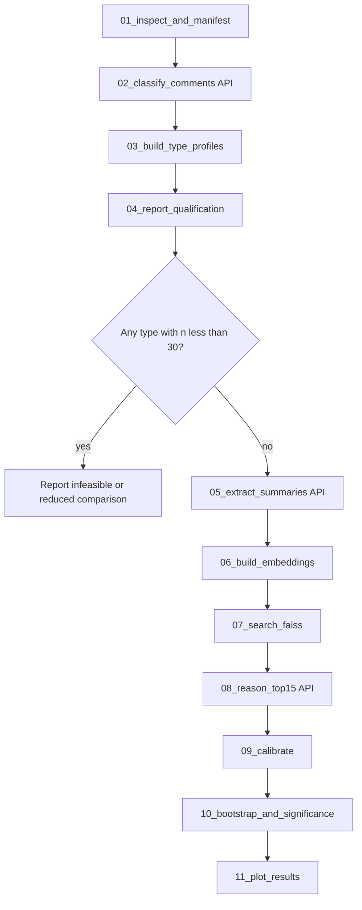

# Content-Type Experiment — Implementation Plan (Step 8)

**Status:** Plan only. No API calls have been run.

## Research question

At fixed text volume (50 comments), are some comment types more identifying than others?

| Label | Meaning |
|-------|---------|
| **P** | Personal disclosure (facts about the author's life) |
| **O** | Opinion / value statement |
| **T** | Topical discussion without personal disclosure |

---

## Inspection summary

### Query data (classification input)

| Artifact | Path | Notes |
|----------|------|-------|
| Raw query JSONL | `data/raw/POOL-EN/user_*_query.jsonl` | **500** files; fields `a`, `b`, `s`, `t`, `v` |
| T4 truncated text | `data/esrc/pool_en/truncated_queries/T4/` | **500** files; **50 lines** each (comment text only) |
| Full query history | same JSONL files | **500 comments/user** (all users) |

**T4 comment statistics** (500 users × 50 comments = **25,000** comments):

| Metric | Value |
|--------|------:|
| Comments per user (T4) | 50 (fixed) |
| Median comment length | 18 words / 99 chars |
| p90 comment length | 74 words / 416 chars |

### Candidate data (ESRC reuse — no classification)

| Artifact | Path | Notes |
|----------|------|-------|
| Candidate summaries | `data/esrc/pool_en/candidate_summaries/` | **1,000** files |
| Candidate embeddings | `data/esrc/pool_en/embeddings/candidate_embeddings.npy` | reuse |
| Candidate index | `results/tables/pool_en_candidate_embeddings_index.csv` | reuse |

Candidates are **not** classified. Same closed pool as main Reddit / diversity experiments.

### Critical spec clarification

Step 8.1 says classify comments **in T4 profiles** (50 comments/user).

Step 8.2 requires **first 50 comments of type P / O / T** per user, with qualification only for users having **≥ 50 of each type**.

That cannot be satisfied from 50 T4 comments alone (at most 50 labels total per user).

**Recommended interpretation (feasible):**

1. Classify the **full chronologically sorted query history** (500 comments/user).
2. For each user, take the **first 50 comments** of each type (by timestamp) to build P-only, O-only, and T-only profiles.
3. Include only users with **≥ 50 P, ≥ 50 O, and ≥ 50 T** in their full history.
4. Report how many users qualify (expected to be **well below 500**; exact count unknown until classification).

**Alternative (narrower, cheaper):** classify T4 window only and relax qualification to “maximum available per type within T4” — **not recommended** because profiles would have unequal comment counts and break the fixed-volume comparison.

---

## Proposed workflow



### Phase 0 — No API

| Script | Purpose | Output |
|--------|---------|--------|
| `01_inspect_feasibility.py` | Validate JSONL, count comments, dry-run manifest | `content_type_inspection.csv` |
| `03_build_type_profiles.py` | Build P/O/T profile `.txt` files from classifications | `data/content_types/{P,O,T}/` |
| `04_report_qualification.py` | Per-user type counts; qualification flags | `content_type_qualification.csv` |

### Phase 1 — Classification API (`gpt-4o-mini`)

| Script | Purpose | Output |
|--------|---------|--------|
| `02_classify_comments.py` | Batch-classify query comments | `content_type_classifications.csv`, `content_type_classify_log.csv` |

### Phase 2 — ESRC per content type (same pattern as diversity)

| Script | Purpose | API? |
|--------|---------|------|
| `05_extract_summaries.py` | Lermen G.2 Extract per type | **Yes** (gpt-4o-mini) |
| `06_build_type_embeddings.py` | all-mpnet-base-v2 | No |
| `07_search_faiss.py` | Top-15 vs existing candidate index | No |
| `08_reason_top15.py` | Lermen record selection | **Yes** (gpt-4o-mini) |
| `09_calibrate_precision_recall.py` | PR curves, Recall@90/99 | No |
| `10_bootstrap_and_significance.py` | Bootstrap CI + pairwise z-tests | No |
| `11_plot_results.py` | Figures | No |

---

## Classification prompt

Stored at: `prompts/content_type_classification.txt`

**Design choices:**

- JSON array output with `comment_index` → enables **batched** classification and reliable parsing.
- Explicit tie-break rule: personal disclosure beats opinion when mixed.
- Short-comment guidance reduces ambiguous labels.
- `response_format={"type": "json_object"}` for structured output.

**Seminar baseline prompt** (single-comment) is preserved as the core instruction; batch wrapper adds numbering and JSON schema.

---

## Individual vs batch classification

| Approach | API calls (full history) | Pros | Cons |
|----------|-------------------------:|------|------|
| **Individual** (1 comment/call) | **250,000** | Simple; easy retry | Slow; expensive; high rate-limit risk |
| **Batch n=10** (recommended) | **25,000** | ~10× cheaper; fewer HTTP round-trips | Occasional parse errors; need partial retry |
| **Batch n=20** | **12,500** | Cheaper still | Higher truncation risk for long comments |
| **Batch n=25** | **10,000** | Minimum calls | May exceed context on p90-long batches |

### Recommendation: **batch size = 10**

- Median comment ≈ 18 words; batch of 10 ≈ 180 words + prompt ≈ safe margin.
- p90 single comment ≈ 74 words; batch of 10 ≈ 740 words — still well within gpt-4o-mini context.
- Align batches **within user** (preserve `comment_index` for chronological merge).
- On JSON parse failure: retry batch once; then fall back to individual calls for that batch only.

**T4-only classification** (if ever needed for auxiliary analysis): **2,500 calls** at batch=10.

---

## API call estimates

### Classification (full 500-comment histories)

| Batch size | API calls | Est. input tokens | Est. output tokens | Est. cost (gpt-4o-mini) |
|-----------:|----------:|------------------:|-------------------:|------------------------:|
| 1 | 250,000 | ~9.4M | ~0.75M | **~$1.9–$2.5** |
| **10** | **25,000** | ~**3.1M** | ~**0.19M** | **~$0.55–$0.70** |
| 20 | 12,500 | ~2.2M | ~0.10M | ~$0.40–$0.50 |

Pricing assumption: $0.15/1M input, $0.60/1M output (verify at run time).

### ESRC (after qualification — depends on qualifying users)

Let **n** = users qualifying for all three types (unknown; denote upper bound **n ≤ 500**).

| Stage | Calls | Est. cost |
|-------|------:|----------:|
| Extract (3 types × n users) | 3n | ~$0.02–0.05 per user → **~$30–75** at n=500 |
| Reason (3 types × n users) | 3n | similar to diversity (~$0.0005/call) → **~$0.75** at n=500 |

**If n qualifies ≈ 50–150** (plausible), total ESRC API cost may be **~$5–25**.

### Total experiment (classification + ESRC)

| Scenario | Classification | ESRC (n users) | Total (rough) |
|----------|---------------:|---------------:|--------------:|
| Optimistic (n≈150) | ~$0.60 | ~$10 | **~$11** |
| Upper bound (n=500) | ~$0.60 | ~$75 | **~$76** |

Seminar budget line item: **~$13** for diversity + content-type combined — classification is cheap; **Extract dominates** if all 500 users qualify for all types.

---

## Qualification risk

Until classification runs, the number of users with ≥ 50 P, ≥ 50 O, and ≥ 50 T is **unknown**.

**Feasibility safeguards in pipeline:**

1. `04_report_qualification.py` prints per-type counts and qualified user totals.
2. If any type has **n < 30** qualified users, flag **underpowered** in `content_type_summary.csv`.
3. If **zero** users qualify for all three types, stop before ESRC; report infeasibility.
4. Optional fallback (document only, do not run unless approved): compare types at **25 comments** or use users qualifying for **≥ 2 types** only.

---

## Output files (final)

### Tables

- `results/tables/content_type_classifications.csv`
- `results/tables/content_type_qualification.csv`
- `results/tables/content_type_reason_predictions.csv`
- `results/tables/content_type_recall_at_precision.csv`
- `results/tables/content_type_precision_recall_curve.csv`
- `results/tables/content_type_summary.csv`
- `results/tables/content_type_bootstrap_ci.csv` (optional, mirror diversity)
- `results/tables/content_type_significance_tests.csv` (optional)

### Figures

- `results/figures/content_type_top1_accuracy.png`
- `results/figures/content_type_top1_accuracy_with_ci.png`
- `results/figures/content_type_recall_at_90.png`

### Data directories

- `data/content_types/P/`, `O/`, `T/` — 50-comment type-filtered profiles
- `data/content_types/summaries/{P,O,T}/`
- `data/content_types/embeddings/{P,O,T}/`

---

## Script inventory (to implement)

```
experiments/content_type/
├── config.py                    ✓ created
├── IMPLEMENTATION_PLAN.md       ✓ this file
├── README.md                    ✓ created
├── 01_inspect_feasibility.py    pending
├── 02_classify_comments.py      pending (API)
├── 03_build_type_profiles.py    pending
├── 04_report_qualification.py   pending
├── 05_extract_summaries.py      pending (API)
├── 06_build_type_embeddings.py  pending
├── 07_search_faiss.py           pending
├── 08_reason_top15.py           pending (API)
├── 09_calibrate_precision_recall.py pending
├── 10_bootstrap_and_significance.py pending
└── 11_plot_results.py           pending
```

---

## Execution order (when approved)

```bash
# Phase 0 — no API
.venv/bin/python3 experiments/content_type/01_inspect_feasibility.py

# Phase 1 — classification API
.venv/bin/python3 experiments/content_type/02_classify_comments.py --batch-size 10

# Phase 0 continued — depends on classifications
.venv/bin/python3 experiments/content_type/03_build_type_profiles.py
.venv/bin/python3 experiments/content_type/04_report_qualification.py

# STOP if qualification too low — await confirmation

# Phase 2 — ESRC API + analysis
.venv/bin/python3 experiments/content_type/05_extract_summaries.py
.venv/bin/python3 experiments/content_type/06_build_type_embeddings.py
.venv/bin/python3 experiments/content_type/07_search_faiss.py
.venv/bin/python3 experiments/content_type/08_reason_top15.py
.venv/bin/python3 experiments/content_type/09_calibrate_precision_recall.py
.venv/bin/python3 experiments/content_type/10_bootstrap_and_significance.py
.venv/bin/python3 experiments/content_type/11_plot_results.py
```

---

## Constraints (unchanged from project rules)

- Do **not** modify main ESRC pipeline or `pool_en_*` outputs.
- Do **not** classify candidate comments.
- Use **gpt-4o-mini** for classification, Extract, and Reason.
- Use **random_seed=42** for any sampling.
- Do **not** update `paper.tex` until results exist.
